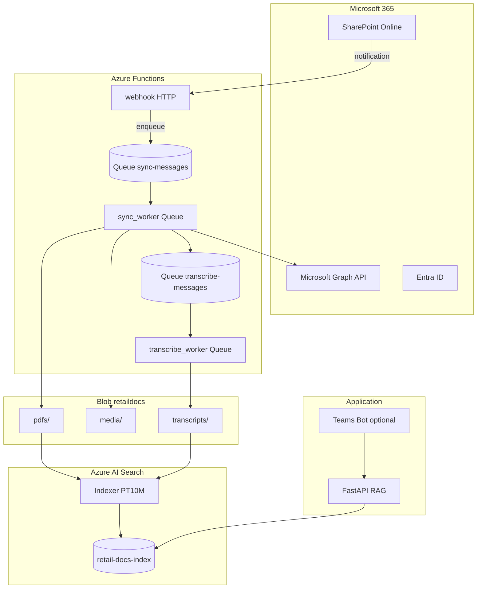

# RAG Architecture — Learning Notes

Notes from design discussions for the retail RAG app (`az-ai-search`): current implementation, SharePoint ingestion, video, ACLs, Teams, queues, and indexing.

---

## 1. What exists today

```
Azure Blob (retaildocs) → Indexer + Skillset → retail-docs-index → FastAPI /api/chat
```

| Piece | Location | Notes |
|-------|----------|-------|
| Index | `retail-docs-index` | Hybrid search + vectors |
| Skillset | Split 500 chars / 100 overlap + embed | `setup/create_skillset.py` |
| Chat API | `app/routes/chat.py` | Session in memory, citations filtered by answer |
| LLM | gpt-5-mini-1 | `reasoning_effort=low`, threshold quoting in prompt |
| Source | Manual PDF upload to blob | 9 policy PDFs in `retaildocs` |

**Not built yet:** SharePoint sync, video transcription, ACL enforcement, Teams client.

---

## 2. Getting content from SharePoint — options

### Option A: SharePoint → Blob → Blob indexer (reuse current stack)

```
SharePoint → sync layer → Blob → existing indexer → index → FastAPI
```

| Pros | Cons |
|------|------|
| Reuses skillset, index, chat API | Extra hop; duplicate storage |
| Blob = audit / reprocess cache | ACLs not automatic |
| Good with Function + video pipeline | Two systems to monitor |

### Option B: Native SharePoint indexer (AI Search)

```
SharePoint → SharePoint indexer (Graph) → skillset → index → FastAPI
```

| Pros | Cons |
|------|------|
| No blob middle layer | Preview feature; Entra app setup |
| Incremental deletes (SharePoint) | **No video transcription** |
| ACL ingest possible (preview) | Different datasource scripts |

### Option C: Function + Blob + video (diagram you saw)

```
SharePoint → Function (Graph poll or webhook) → Blob → indexer
              └─ chunk / transcribe video
```

Required when you need **MP4 → searchable text**. Native indexer does not transcribe video.

### Option D: Remote SharePoint knowledge source (Foundry / Copilot)

SharePoint enforces permissions at query time; no local index copy. Different architecture from this FastAPI RAG.

---

## 3. Native SharePoint indexer — how it works

**Pull model — no webhook required.**

```
Indexer schedule (e.g. 5h) or Run Indexer
  → Graph API + app credentials
  → change tracking (internal high-water mark)
  → download changed files only
  → skillset → index
```

| Question | Answer |
|----------|--------|
| Webhook needed? | **No** |
| Graph permissions? | `Files.Read.All`, `Sites.Read.All` or `Sites.Selected` + admin consent |
| Empty poll cost? | Search SKU fixed; Graph not per-call metered; **no embedding** if nothing changed |
| Video? | **Not supported** (no speech-to-text in skillset) |

---

## 4. ACLs (permissions)

**Two jobs — neither is fully automatic for a custom FastAPI app.**

| Job | SharePoint indexer (ACL preview) | Function + Blob path |
|-----|----------------------------------|----------------------|
| **Ingest** ACLs into index | Microsoft can (preview) | **You:** Graph permissions on sync |
| **Query** filter | **You:** FastAPI + OData filter | **You:** same |

```
Ingest:  allowed_principals on each chunk (user/group OIDs)
Query:   search filter BEFORE LLM — ACL on retrieved chunks, not on embedding vector
```

**Teams helps query-time ACL:** user arrives with Entra OID + groups (cache Graph `memberOf`, don’t call every message).

**Policy reference:** `04_information_security_access_policy.pdf` — test scenarios A01/A02 (SecurityReaders).

---

## 5. Session context and search (chat app)

| Layer | Uses session history? |
|-------|------------------------|
| **Search** (`search_chunks`) | **No** — only current message |
| **LLM answer** | **Yes** — last turns in prompt |

**Follow-up example:** “What about above 5k?” after claims discussion — LLM uses history; search alone may retrieve weak chunks.

**Improvement (not required for demo):** query rewrite from history before search (multi-turn window or LLM rewrite).

**Teams session:** map Bot Framework `conversation.id` → `session_id`.

---

## 6. Teams client

**Bot not required.** Alternatives:

| Path | Bot? | Identity |
|------|------|----------|
| Azure Bot → Teams chat | Yes | `aadObjectId` from activity |
| Teams Tab + SSO | No | JWT from Teams JS SDK |

FastAPI RAG backend stays the same; only the entry layer changes.

---

## 7. Deletes and renames

| Path | Delete from index? | Rename? |
|------|-------------------|---------|
| **Blob indexer (default)** | **No** unless soft-delete tracking configured | Old chunks may remain |
| **SharePoint indexer** | Yes on next run | Change tracking handles |
| **Function → Blob** | Function must **delete blob**; configure blob delete detection |

**Current repo:** no delete detection on blob datasource — manual reset or add config for production.

---

## 8. Indexer triggering

Blob upload **does not** start the indexer automatically.

| Method | When |
|--------|------|
| **Indexer schedule** (5h, 10m, …) | Azure polls blob incrementally |
| **Function calls `run_indexer`** | After sync batch (use **run only**, not reset) |
| **Event Grid on blob** | Optional; debounce recommended |

**For low-update docs:** webhook/queue sync + **indexer every 10 min** is enough; no `run_indexer` from Function unless you need instant search.

---

## 9. Webhooks, queues, debouncing

### SharePoint → Function

| Mode | Idle week Function runs |
|------|-------------------------|
| Webhook push | **0** if no changes |
| 2-min timer on empty queue | **~5,040/week** — avoid for rare updates |
| Daily Graph delta poll | **7/week** |

### Debouncing 20 uploads

Without dedupe: 20 indexer runs, Graph 429 risk, duplicate embedding $ if same file re-processed.

**Batch pattern:** webhook enqueues only; worker processes; dedupe by `itemId`; one indexer run per batch (if using explicit run).

### 2-min queue timer

Polls **your queue**, not SharePoint. Still wasteful when idle — prefer **queue-trigger worker** (runs only when messages exist).

---

## 10. Video processing

Skillset chunks **text** only. Video needs transcription (Azure Speech, Whisper, etc.).

**Wrong:** download → transcribe in memory → write transcript (timeout = data loss).

**Right:** checkpoint early:

```
sync_worker → blob/media/{item-id}.mp4   FIRST
transcribe_worker → blob/transcripts/{item-id}.txt
indexer indexes pdfs/ + transcripts/ only (not raw MP4)
```

**Indexer timing:** transcript must exist in blob before indexer pass (10 min schedule or explicit run after transcribe).

---

## 11. Recommended architecture (final)

**Queue-first webhook + worker + scheduled indexer**



### Component table

| # | Component | Trigger | Responsibility |
|---|-----------|---------|----------------|
| 1 | **webhook** | HTTP (Graph) | Validate → enqueue `{itemId, siteId, changeType}` → **202** (< 1s) |
| 2 | **sync-messages** | — | Durable backlog |
| 3 | **sync_worker** | Queue | Graph download → blob + ACL metadata |
| 4 | **transcribe-messages** | — | Video jobs only |
| 5 | **transcribe_worker** | Queue | `media/` → `transcripts/` |
| 6 | **retail-indexer** | **Every 10 min** | Incremental: `pdfs/` + `transcripts/` → index |
| 7 | **FastAPI** | HTTP | Hybrid search + ACL filter + LLM |
| 8 | **Teams Bot** (opt.) | Chat | User OID → API |

### PDF flow

```
SharePoint change → webhook → queue → sync_worker → blob/pdfs/ → indexer (≤10 min) → chat
```

### Video flow

```
SharePoint change → webhook → queue → sync_worker → blob/media/
  → transcribe queue → transcribe_worker → blob/transcripts/
  → indexer (≤10 min) → chat
```

### Push vs poll

| Step | Mode |
|------|------|
| SharePoint → webhook | Push |
| webhook → queue | Push |
| queue → worker | Event |
| worker → blob | Push |
| blob → indexer | **Poll** (10 min schedule) |
| User → chat | Push |

### Failure recovery

| Failure | Data lost? |
|---------|------------|
| Webhook before enqueue | Graph retries notification |
| After enqueue | **No** — message in queue |
| Worker before blob write | Queue redelivers |
| After PDF/MP4 in blob | **No** — idempotent paths `{drive-item-id}` |
| After transcript in blob | **No** — indexer catches up |

---

## 12. Cost notes

| Activity | Billing |
|----------|---------|
| AI Search SKU | Fixed monthly |
| Indexer idle runs (10 min) | Included; ~0 docs processed |
| Function (queue-trigger) | Per execution; **0 when queue empty** |
| Graph | Not typically per-call; watch 429 bursts |
| Embeddings | **Per token** when indexer processes **changed** docs |
| Transcription | **Per audio minute** when video processed |

**Avoid:** `reset_indexer` on routine runs; duplicate re-embed of same file; 2-min timer on empty queue.

---

## 13. Chat app learnings (implemented)

| Topic | Detail |
|-------|--------|
| GPT-5 empty answers | Use `max_completion_tokens=4096`, `reasoning_effort=low` |
| Threshold grounding | Prompt: quote doc thresholds; compare user amounts |
| Citations | Filter to docs mentioned in answer (`filter_citations_for_answer`) |
| Snippets to LLM | `LLM_SNIPPET_CHARS=450`, `LLM_TOP_K_CHUNKS=5` |
| Session follow-ups | History in LLM prompt (GPT-5 single-turn with Previous conversation) |

---

## 14. Decision summary

| Question | Recommendation |
|----------|----------------|
| SharePoint for PDFs only? | Native indexer **or** simple blob sync |
| SharePoint + video? | **Function + Blob + transcribe queues** |
| Sync trigger? | **Webhook → queue** (not download in webhook) |
| Index trigger? | **Indexer schedule 10 min** (no Function `run_indexer` unless instant needed) |
| Idle cost? | No 2-min timer; queue-trigger workers only |
| ACLs? | Ingest `allowed_principals` + FastAPI filter; Teams for identity |
| Teams? | Bot **or** Tab + SSO; thin client → FastAPI |
| Deletes? | Function deletes blob + blob delete detection; or SharePoint indexer |
| Demo now | Keep blob + manual indexer; add SharePoint/Teams later |

---

## 15. Test corpus

Local reference PDFs: `/pdfs/` (same content as blob `retaildocs`).

Use `00_rag_test_scenarios_and_expected_results.pdf` for curl/Teams test questions (P01–P05, N01–N02, F01–F05, A01–A02, etc.).

Example:

```bash
curl -s -X POST http://localhost:8000/api/chat \
  -H "Content-Type: application/json" \
  -d '{"message": "What is the standard return window for merchandise?"}'
```

Expected: **30 calendar days** from `03_returns_refunds_and_exceptions.pdf`.

---

## 16. Related files

| File | Purpose |
|------|---------|
| `app/services/search.py` | Hybrid search, citations |
| `app/services/llm.py` | RAG prompt, GPT-5 settings |
| `app/routes/chat.py` | `/api/chat`, sessions |
| `setup/create_*.py` | Index, datasource, skillset, indexer |
| `setup/run_indexer.py` | Manual indexer run (uses reset — dev only) |
| `.env.example` | Configuration reference |

---

*Last updated from architecture planning discussions (SharePoint, video, ACL, Teams, queues, indexing).*
